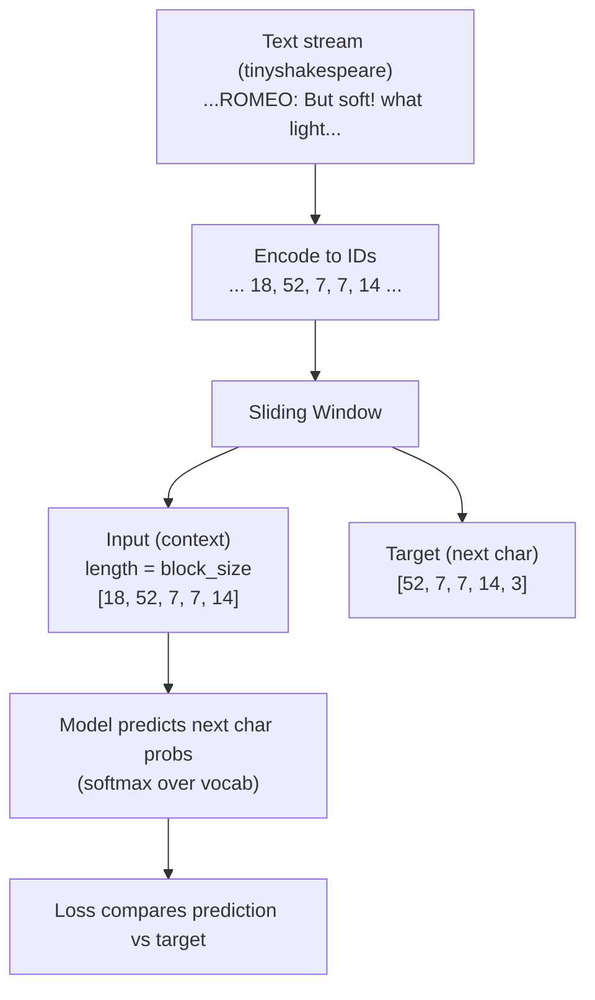

# Character-Based Tokenizer

This is a simple, educational **character-level tokenizer** for NLP / LLM experiments. This turns text into a sequence of **character IDs** (and back again), so you can train language models (RNNs, Transformers, etc.) without needing complex tokenization like BPE/WordPiece.

## Tokenization

Computers don’t understand words the way humans do — they understand **numbers**.

So before an AI model (like an LLM) can learn from text, we have to **break the text into pieces** and turn those pieces into **IDs (numbers)**.  
That process is called **tokenization**.

### A simple example
Text:
`"hi!"`

Tokenization (character-based):
`["h", "i", "!"]`

Then we map each character to a number:
`["h", "i", "!"] → [8, 9, 3]` (example)

Now the model can work with it — because models learn from numbers.

### Why tokenization is useful for LLMs
LLMs learn a game called **“predict the next thing”**.

If the model sees:
`"To be or not to b"`

It tries to predict the next character:
`"e"`

To do that, it needs the text in a format it can process (numbers), and tokenization gives it that.

---

## Why character-level tokenization?

Many LLMs use bigger token pieces (like word chunks), but **character tokenization is the simplest to understand**:

- It works on *any* text you give it (even weird names or symbols)
- It makes it super clear how a dataset like **tinyshakespeare** becomes training data
- It’s perfect for learning the foundations of NLP and Transformers

The tradeoff is that character sequences are longer, so models may need more steps to learn. But for learning and small experiments, it’s awesome.

> In this project, we use **tinyshakespeare** text and turn it into character IDs so a model can learn patterns and generate text one character at a time.

A **character-based tokenizer** is the simplest possible approach:

- Input: `"hello"`
- Tokens: `["h", "e", "l", "l", "o"]`
- IDs: `[8, 5, 12, 12, 15]` (example)

### Pros
- **Easy to understand & implement**
- Handles **any text** (no “unknown word” problems)
- Great for learning how datasets, embeddings, and models fit together

### Tradeoffs
- Sequences are **longer** (more compute/memory)
- Harder for models to learn long-range structure efficiently vs subword tokenizers

---

## How it works

1. **Build a vocabulary**
   - Gather all unique characters in your dataset
   - Assign each character a unique integer ID

2. **Encode**
   - Convert each character to its ID
   - Optionally add special tokens like:
     - `<PAD>` for padding
     - `<UNK>` for unknown characters
     - `<BOS>` / `<EOS>` for begin/end of sequence

3. **Decode**
   - Convert IDs back to characters
   - Join them into a string

That’s it. This is the core mechanism behind all tokenizers—just with characters instead of subwords.



---

## Installation

Clone the repo:

```bash
git clone https://github.com/WolfeTyler/Character-Based-Tokenizer.git
cd Character-Based-Tokenizer
```

---

## Quickstart

> **Note:** Replace `character_tokenizer` / `CharacterTokenizer` below with the exact module/class names used in this repo if they differ.

### 1) Build the vocabulary

```python
from character_tokenizer import CharacterTokenizer

text = "Hello, Skyrim! Hello, Morrowind!"
tok = CharacterTokenizer()
tok.fit(text)

print("Vocab size:", tok.vocab_size)
```

### 2) Encode / decode

```python
ids = tok.encode("Hello!")
print(ids)

text = tok.decode(ids)
print(text)
```

---

## Common features you may include

Depending on how you implemented it, your tokenizer may support:

### Special tokens (recommended)
Typical IDs:

- `0 -> <PAD>`
- `1 -> <UNK>`
- `2 -> <BOS>`
- `3 -> <EOS>`

This makes it easier to train batches and handle unseen characters.

### Padding & truncation
When training models, you often need equal-length sequences:

```python
batch = tok.encode_batch(
  ["hi", "hello", "hey there"],
  max_length=16,
  padding=True,
  truncation=True
)
```

### Save / load
So you can reuse the same vocabulary later:

```python
tok.save("artifacts/tokenizer.json")
tok2 = CharacterTokenizer.load("artifacts/tokenizer.json")
```

---

## Example: Using with a tiny PyTorch model

Character tokenization typically feeds into an **embedding layer**:

```python
import torch
import torch.nn as nn

vocab_size = tok.vocab_size
embed_dim = 64

embedding = nn.Embedding(num_embeddings=vocab_size, embedding_dim=embed_dim)

x = torch.tensor([tok.encode("hello")], dtype=torch.long)  # shape: [batch, seq]
y = embedding(x)                                           # shape: [batch, seq, embed_dim]
```

---

## Suggested project layout

```
Character-Based-Tokenizer/
  character_tokenizer.py
  examples/
    quickstart.ipynb
  data/
    sample.txt
  artifacts/
    tokenizer.json
  tests/
    test_tokenizer.py
  README.md
```

---

## Roadmap ideas (nice interview signals)

- [ ] Add `encode_batch()` with padding/truncation
- [ ] Add `BOS/EOS` handling
- [ ] Add tests for round-trip correctness: `decode(encode(x)) == x`
- [ ] Add a notebook showing:
  - vocab creation
  - embedding visualization (PCA/TSNE)
  - a tiny char-level language model demo

---

## References & Links

Tokenization basics:
- Hugging Face NLP Course (Tokenization): https://huggingface.co/learn/nlp-course/en/chapter2/4
- Background (Tokenization concept): https://en.wikipedia.org/wiki/Lexical_analysis

Subword tokenization (what you’ll likely learn next):
- Hugging Face NLP Course (BPE): https://huggingface.co/learn/nlp-course/en/chapter6/5
- OpenAI tiktoken: https://github.com/openai/tiktoken
- Hugging Face tokenizers: https://github.com/huggingface/tokenizers

Char-level modeling inspiration:
- Karpathy minGPT: https://github.com/karpathy/minGPT
- Karpathy nanoGPT: https://github.com/karpathy/nanoGPT
